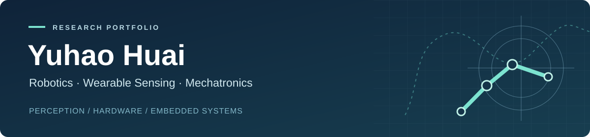

  

  <a href="https://github.com/YuhaoHuai">GitHub</a> &nbsp;·&nbsp;
  <a href="mailto:huaiyuhao2001@gmail.com">Email</a> &nbsp;·&nbsp;
  <a href="#featured-projects">Featured Projects</a> &nbsp;·&nbsp;
  <a href="#selected-publication">Publication</a> &nbsp;·&nbsp;
  <a href="projects/README.md">All Projects</a>

## Hi, I'm Yuhao 👋

My background is in **mechanical engineering**, with research and project experience at **Stanford University** and the **University of Wisconsin–Madison**. I work on robotic perception, wearable sensing, and electromechanical systems.

I am interested in how robots estimate motion and interact with the physical world. My work spans camera–IMU integration, embedded control, mechanical prototyping, and experimental instrumentation. I enjoy connecting these pieces into working systems, from a sensor stream or a CAD model through to a physical prototype and its evaluation.

- **Research interests:** robot perception and state estimation, wearable sensing, and dexterous robotic hardware.
- **Recent work:** wearable visual–inertial odometry and an anatomy-informed, tendon-driven bionic hand.
- **Engineering focus:** sensing, mechanical design, and embedded software developed together.
- **Academic goal:** PhD research in robotics and mechatronics.

## Featured Projects

<table>
<tr>
<td width="50%" valign="top">

### 🤖 Argus · Wearable VIO

A wearable camera–IMU system for motion estimation, with a host-side workflow for human-motion visualization.

**My contribution:** sensing hardware, calibration and synchronization, a ROS 2 VIO pipeline, and OpenSim integration.

`C++` `ROS 2` `OpenCV` `Sensor Fusion`

**Stage:** Research prototype.

[Project overview](projects/argus-wearable-vio/README.md) · [Code · private](https://github.com/YuhaoHuai/Argus)

</td>
<td width="50%" valign="top">

### 🦾 Tendon-Driven Bionic Hand

An anatomy-informed hand design exploring printable finger structures, tendon routing, and servo actuation.

**My contribution:** finger and spool design iterations, nylon-cord actuation, and a little-finger mechanical prototype.

`Mechanical Design` `3D Printing` `Servo Control`

**Stage:** Single-finger prototype; full-hand integration in progress.

[Project overview](projects/tendon-driven-bionic-hand/README.md)

</td>
</tr>
<tr>
<td width="50%" valign="top">

### ⚙️ Autonomous Mobile Robot

A Stanford ME218B robot for starting-side identification, autonomous navigation, and target collection and delivery.

**My contribution:** team leadership, infrared sensing, and event-driven PIC32 control for sensing, motion, and task execution.

`PIC32` `Embedded C` `Mechatronics`

**Context:** Team course project.

[Project overview](projects/autonomous-mobile-robot/README.md) · [Project website](https://sites.google.com/view/where-is-screwdriver/home)

</td>
<td width="50%" valign="top">

### 📐 Interactive Mohr's Circle

A physical and computational learning tool for exploring stress states and Mohr's circle transformations.

**My contribution:** teaching-tool design, mathematical modeling, MATLAB simulation, and physical-input signal conversion.

`MATLAB` `Instrumentation` `Engineering Education`

**Output:** Co-authored ASEE 2024 conference paper.

[Project overview](projects/mohrs-circle-learning-tool/README.md) · [Paper](https://peer.asee.org/learning-tool-to-enhance-understanding-of-stress-states-and-mohr-s-circle.pdf)

</td>
</tr>
</table>

## Selected Publication

**Learning Tool to Enhance Understanding of Stress States and Mohr's Circle**  
Simon Livingston-Jha, Haozhong Deng, **Yuhao Huai**, and Jennifer Detlor  
*2024 ASEE Annual Conference & Exposition*

[Read the paper](https://peer.asee.org/learning-tool-to-enhance-understanding-of-stress-states-and-mohr-s-circle.pdf) · [Project details](projects/mohrs-circle-learning-tool/README.md)  
DOI: `10.18260/1-2--47723`

## More Engineering Projects

<b>Explore five more projects in embedded systems, instrumentation, manufacturing, and computer vision</b>

 

| Project | My work |
| --- | --- |
| [PIC32 Embedded Arcade System](projects/pic32-arcade-system/README.md) | Input processing, game-state logic, actuator control, and LED matrix feedback. |
| [Dynamic Loading Instrument Optimization](projects/dynamic-loading-instrument/README.md) | Arduino-based infrared measurement and experimental data acquisition. |
| [Wing Nut Injection Mold Design](projects/wing-nut-injection-mold/README.md) | Gate placement, cooling-channel analysis, and mold design for manufacturability. |
| [Smart Safety Helmet Structural Design](projects/smart-safety-helmet/README.md) | Structural modeling, finite element analysis, and molding simulation during an internship. |
| [Fabric Defect Visual Detection](projects/fabric-defect-detection/README.md) | Support for OpenCV inspection and CNN training in PyTorch during an internship. |

[Browse the complete project index →](projects/README.md)

## Technologies & Tools

| Area | Experience |
| --- | --- |
| Programming | `C++` `Python` `MATLAB` `Embedded C` |
| Robotics & perception | `ROS 2` `OpenCV` `OpenSim` `Camera–IMU Calibration` |
| Embedded platforms | `Raspberry Pi` `PIC32` `Arduino` |
| Design & manufacturing | `SolidWorks` `Moldex3D` `3D Printing` `Mechanical Prototyping` |

## Let's Connect

I welcome conversations about PhD research opportunities and collaboration in robotic perception, wearable sensing, and dexterous hardware.

**[huaiyuhao2001@gmail.com](mailto:huaiyuhao2001@gmail.com)** · **[GitHub](https://github.com/YuhaoHuai)**

Project pages describe individual contributions, available materials, and validation status. Private source repositories require access. Project-status evidence was reviewed on September 8, 2026; portfolio presentation updated on September 11, 2026.
