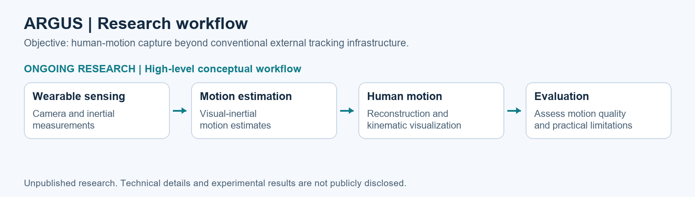
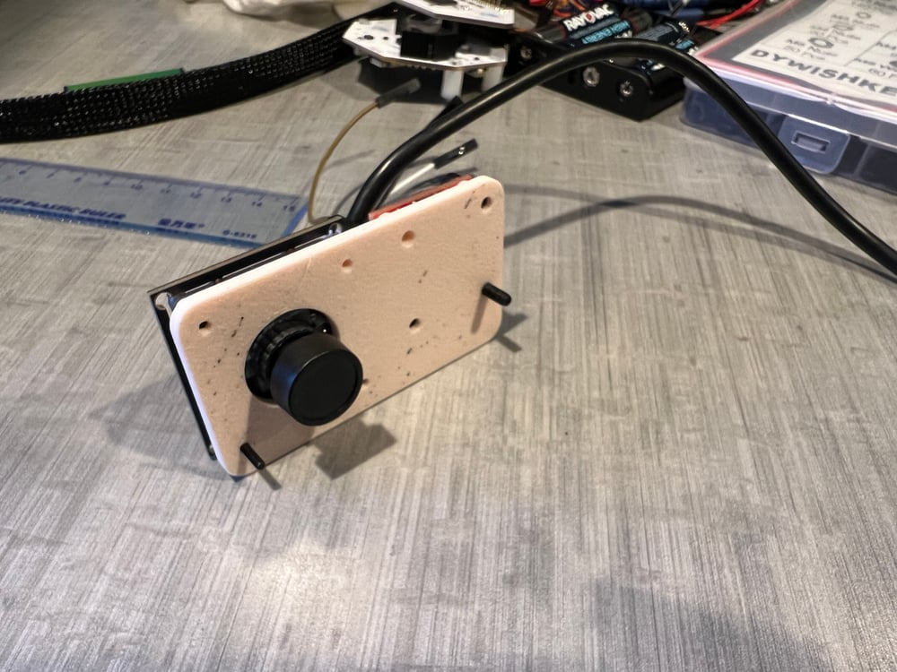
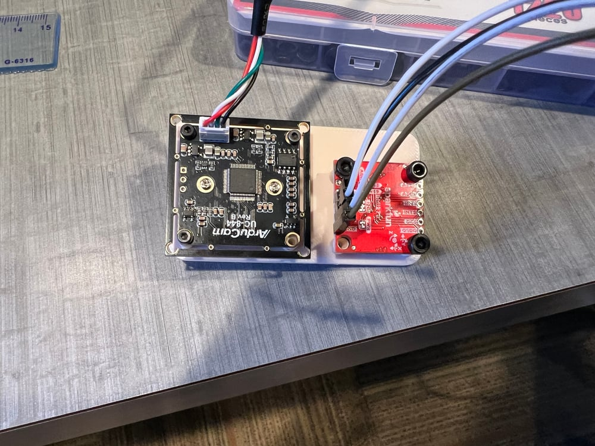

# Argus — Wearable Visual–Inertial Odometry

A wearable sensing research project exploring human motion capture beyond conventional laboratory motion-capture equipment.

**Area:** Robot perception and wearable motion capture  
**Context:** Stanford Assistive Robotics and Manipulation Lab  
**Status:** Ongoing research · Unpublished

## Research objective

Conventional motion capture often depends on external tracking cameras and a dedicated capture space. This project investigates whether wearable cameras and inertial sensors can support human-motion capture without relying on that external infrastructure.

The goal is to make motion capture more portable and usable beyond a conventional motion-capture laboratory. Wearable motion estimation and human-motion visualization are research directions under development; this page does not claim that the system has already matched the accuracy or coverage of a conventional motion-capture setup.

## Research workflow

*Conceptual research workflow. The diagram communicates the research direction, not an implementation specification or a completed validation result.*

## My contribution

- Developed and integrated a wearable camera–inertial sensing prototype.
- Worked on visual–inertial motion estimation and system integration.
- Connected wearable sensing with human-motion reconstruction and visualization.

## Hardware gallery

| Sensor module and mounting plate | Camera and IMU electronics |
| --- | --- |
|  |  |

*Original hardware photographs from a historical project report. These show the sensing assembly, rather than the current implementation or measured performance. [Media sources](../../docs/MEDIA.md).*

## Ongoing research and availability

**This project is ongoing and has not yet been published. Detailed methods, implementation, source code, and experimental results are not publicly disclosed at this stage.** This portfolio provides only a high-level account of the research objective, workflow, and my contributions.

[Back to all projects](../README.md) · [Portfolio home](../../README.md)
