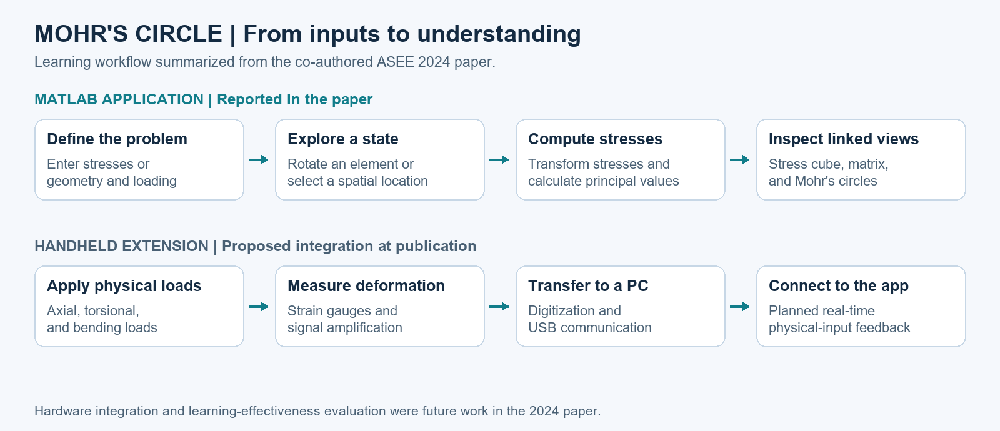
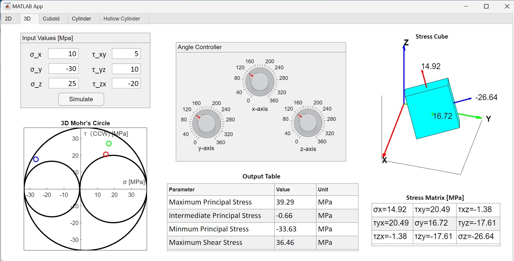
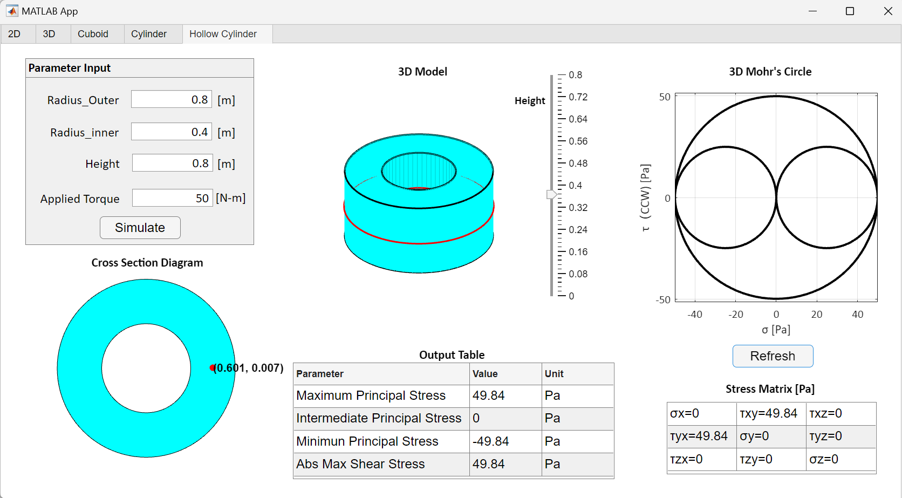
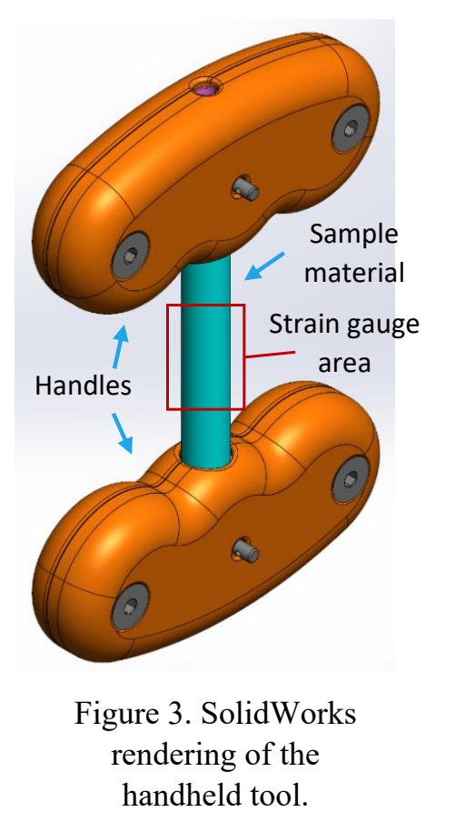

# Interactive Mohr’s Circle Learning Tool

An interactive MATLAB application and a proposed handheld teaching device that connect physical loading, stress transformations, and Mohr’s circle.

**Area:** Engineering education · Mechanics of materials  
**Context:** Detlor Research Group, University of Wisconsin–Madison, May 2023–June 2024  
**Output:** Co-authored paper, 2024 ASEE Annual Conference & Exposition

## Publication

**Learning Tool to Enhance Understanding of Stress States and Mohr's Circle**  
Simon Livingston-Jha, Haozhong Deng, **Yuhao Huai**, and Jennifer Detlor  
*2024 ASEE Annual Conference & Exposition* · DOI: `10.18260/1-2--47723`

[Read the paper](https://peer.asee.org/learning-tool-to-enhance-understanding-of-stress-states-and-mohr-s-circle.pdf)

## Research objective

Students can calculate Mohr’s circle without developing an intuitive understanding of how it relates to a loaded structure. This project aims to bridge that gap through interactive exploration: change the stress state, rotate an element, or select a point in a loaded geometry and observe the corresponding stress visualization.

The longer-term goal is to extend that experience to a handheld device, allowing students to apply physical loads and connect what they feel to the stresses displayed in the application.

## Learning workflow

*Portfolio summary of the workflow described in the 2024 paper. The upper path represents the application; the lower path represents the proposed physical-device extension.*

## Application features

The MATLAB App Designer interface provides five modes: **2D, 3D, cuboid, cylinder, and hollow cylinder**.

- **Explore stress transformations:** enter normal and shear stresses, then change the element’s orientation to inspect the updated stress matrix and stress cube.
- **Read mechanical quantities together:** view Mohr’s circles, principal stresses, and absolute maximum shear stress alongside the geometric representation.
- **Connect loading to location:** define a loaded geometry and select a point in its cross-section to examine the local stress state. The paper’s hollow-cylinder example demonstrates torsional loading.

### 3D stress transformation

*Figure 1 image from the paper, PDF page 3. The linked views help students compare an element’s orientation with its stress state.*

### From a loaded structure to a local stress state

*Figure 2 image from the paper, PDF page 4. Students select a location in the cross-section and refresh the stress visualization.*

## Handheld device concept

The proposed device uses a deformable sample between two handles to explore axial loading, torsion, and bending. Removable pins and a central shaft constrain the available deformation modes. The design routes strain-gauge signals through amplification and digitization to a PC via USB.

  

*Figure 3 from the paper, PDF page 5. This is a CAD design rendering, not a photograph of a completed device.*

## My contribution

- Designed and fabricated teaching tools for mechanics-of-materials instruction.
- Worked on mathematical modeling and MATLAB simulation for stress transformation and visualization.
- Assisted with a converter that translates mechanical inputs into electrical signals for interactive simulation.
- Co-authored the ASEE conference paper.

The application and device descriptions above summarize the team’s published work; this section identifies my contributions.

## Publication-stage status

The 2024 paper reports the MATLAB application and the handheld-device design. Manufacturing, hardware–software integration, and a study of learning effectiveness were identified as future work. The figures here document that publication-stage status; they do not establish a later completed device or measured learning gains.

Figures are reproduced from the co-authored paper by Livingston-Jha, Deng, Huai, and Detlor; © American Society for Engineering Education, 2024. [Paper and figure source](https://peer.asee.org/learning-tool-to-enhance-understanding-of-stress-states-and-mohr-s-circle.pdf) · [Media preparation notes](../../docs/MEDIA.md).

[Back to all projects](../README.md) · [Portfolio home](../../README.md)
