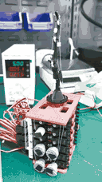
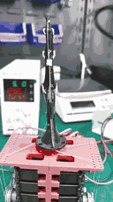

# Tendon-Driven Bionic Hand

An anatomy-informed robotic hand project combining printable finger structures, tendon actuation, geometry adaptation, and MuJoCo control experiments.

**Area:** Robotic hardware and simulation  
**Stage:** Physical little-finger prototype; five-finger simulation and geometry-adaptation prototypes  
**Tools and methods:** Mechanical design · 3D printing · Servo actuation · Python · MuJoCo · OpenCascade

## Physical prototype and videos

The following recordings show the real little-finger prototype and servo-array test rig. Recorded August 28, 2026, they demonstrate flexion and lateral motion qualitatively; they do not measure accuracy, force, or durability.

<table>
<tr>
<td align="center" width="50%">

**Flexion**

[Open or download the full MP4](../../media/bionic-hand/little-finger-flexion.mp4)

</td>
<td align="center" width="50%">

**Lateral motion**

[Open or download the full MP4](../../media/bionic-hand/little-finger-lateral-motion.mp4)

</td>
</tr>
</table>

The GIFs are short previews. The MP4s preserve the complete recorded motion at normal speed and omit audio.

## Latest development

| Date | Work | Current evidence |
| --- | --- | --- |
| September 19, 2026 | [Five-finger MuJoCo model](five-finger-simulation.md) | 141 CAD components, 15 joint degrees of freedom, and 30 actuated main tendons; force, angle, and tendon-displacement interfaces. |
| September 18, 2026 | [Anatomical template adaptation](template-adaptation.md) | Ring-finger geometry transfer, GUI, continuous ligament lofts, symmetric tendon attachments, and checked STEP/3MF exports. |
| August 28, 2026 | Physical little-finger demonstrations | Flexion and lateral-motion recordings shown above. |

## My contribution

- Iterated finger designs from ligament-inspired structures through four- and six-tendon layouts to nylon-cord actuation.
- Built the little-finger mechanical prototype and worked on its servo-driven test setup.
- Developed spool geometry and whole-hand CAD iterations.
- Extended the simulation workflow to all five fingers, including interfaces for force, joint-angle, and tendon-displacement commands.
- Developed a template-adaptation workflow for transferring tendon guides, attachment features, and ligament geometry onto new segmented bone meshes.

## Technical approach

The mechanical design starts from bone geometry, candidate joint axes, ligament attachment, and tendon travel. Physical prototyping explores actuation and assembly. Simulation supports controller and tendon-routing studies, while geometry adaptation explores how to reuse a design across different bone shapes.

*Original engineering render: reference template above, adapted ring finger below. Each view is scaled independently, so this figure is for shape inspection rather than direct length comparison. [Adaptation details](template-adaptation.md).*

## Validation status and next steps

The physical videos establish visible motion of a single finger. Quantitative backlash, load, repeatability, and durability measurements remain to be documented.

The five-finger model passes the recorded control checks at selected test settings. Large-angle tendon routes still intersect geometry, and mesh contact is disabled. Reaching a simulated target angle therefore does not establish feasible physical motion.

The adapted ring-finger output passes recorded static export and geometry checks. Joint motion, material behavior, printing, and fatigue still require validation.

[Related servo-array test device — private; access required](https://github.com/YuhaoHuai/Bionic-Hand-Test-Device)

MyoHand/myo_sim, Aero Hand, and ORCA Hand materials are third-party references, not original implementations. Media provenance is recorded in the [media notes](../../docs/MEDIA.md).

[Back to all projects](../README.md) · [Portfolio home](../../README.md)
