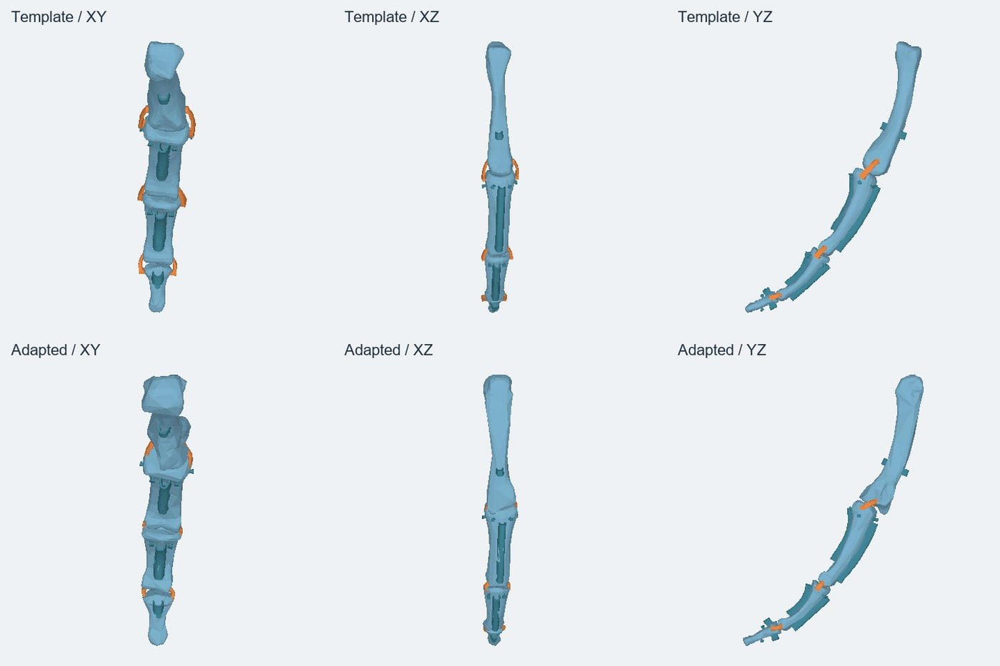
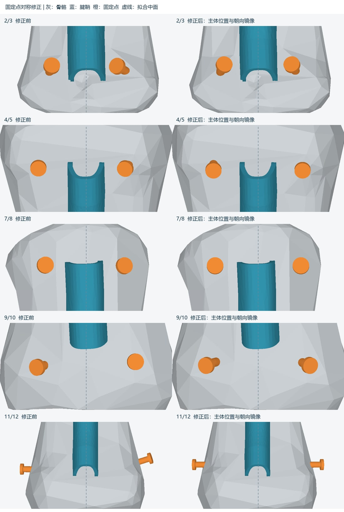

# Anatomical Template Adaptation

**Development snapshot:** September 18, 2026  
**Stage:** Ring-finger geometry prototype with a desktop GUI  
**Tools:** Python · NumPy · trimesh · manifold3d · OpenCascade

## Research question

How can an existing tendon-driven finger design be adapted to a new bone geometry while preserving the intended arrangement of tendon guides, ligament attachments, and functional clearances?

The current implementation takes an existing STEP design template and already segmented STL bone meshes. Raw CT/DICOM segmentation is not part of this prototype.

## Implemented workflow

1. Read the named template components and separate the four target bone meshes.
2. Establish bone correspondence and estimate shape registration.
3. Position each target bone using rotation and translation, keeping its original geometry rather than scaling it to match the template.
4. Transfer eight tendon guides and twelve tendon attachment features, preserving their functional bodies while adapting their embedded connection regions.
5. Rebuild the six exposed ligament spans as continuous lofts and arrange paired tendon attachments symmetrically around guide reference planes.
6. Export material-grouped geometry, re-read STEP and 3MF files, and create inspection reports.

The GUI exposes input selection, parameters, geometry inspection, run history, and export. It currently supports the specific ring-finger template structure; it is not a general CAD editor.

## Geometry inspection

*Top: template. Bottom: adapted geometry. Columns: XY, XZ, and YZ views. Views are independently scaled; compare shape and placement rather than apparent lengths.*

<b>Inspect the tendon attachment symmetry revision</b>

*Original engineering comparison, with Chinese annotations retained. Left: before correction. Right: mirrored attachment placement and orientation. Gray: bones; blue: tendon guides; orange: attachment features. Embedded bases fit each bone surface separately.*

## Current evidence

The September 18 run exported four rigid groups and six ligament bodies. The recorded checks found ten closed manufacturing meshes and ten valid closed STEP solids, with consistent part counts and assembly coordinates after 3MF re-import.

These checks establish static geometry and export consistency. The STEP output is a faceted BRep without the original CAD feature history; the 3MF contains geometry and material categories, not a printer-ready slicing setup.

## Remaining validation

The preliminary motion screen still reports interference in several sampled poses, using provisional joint axes that require review. Full tendon-path clearance, ligament mechanics, pull-out resistance, printing, and fatigue have not been validated. Distal-bone orientation also needs visual confirmation because shape registration can produce competing orientations.

[Back to the bionic hand](README.md) · [Portfolio home](../../README.md)
